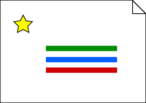
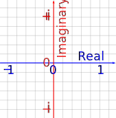

# NapknBook

Napknbook is a tool for creating Imaginary Empires. 

It can be used to create Internet Maps and to trade Imaginary Assets. 

## Internet Maps 

Internet maps are an extension of mind maps to the internet. 

Mind maps are mappings from images to ideas. Internet maps are mappings from 
images to ideas and data. 

Internet maps are the next layer of abstraction that sit ontop of search engines.

## Imaginary Assets 

Imaginary assets are assets that aren't real. 

A few examples are:

Imaginary Estate - property consisting of the pixels of some internet map
Imaginary Labour - work that can be done using just a computer 
Badges - a token that any user can create and give to another 

## The Great Wall of America 

Napknbook gives the user the freedom to determine which users are a part of their internet.

This is done using badges. Users can filter out all the accounts they don't want by only 
allowing accounts that have badges they consider to be trustworthy to influence the content they
see. 

## Internet Palaces 

